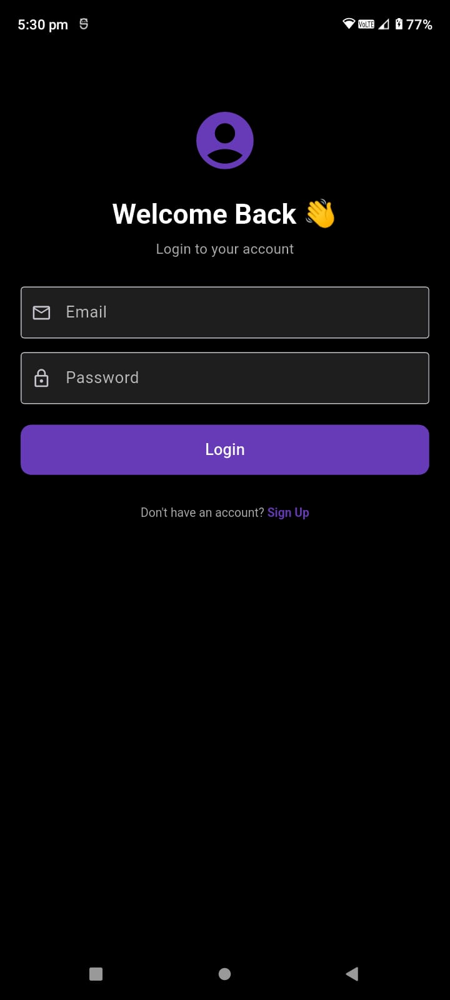
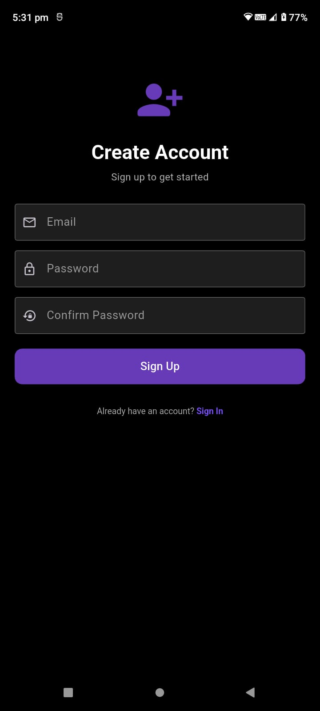
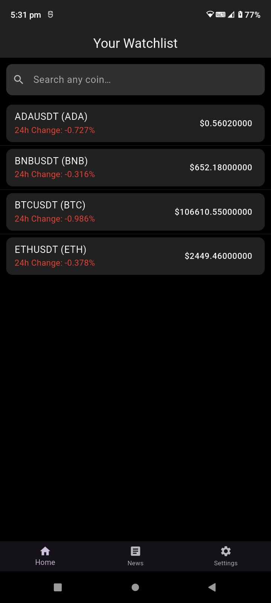
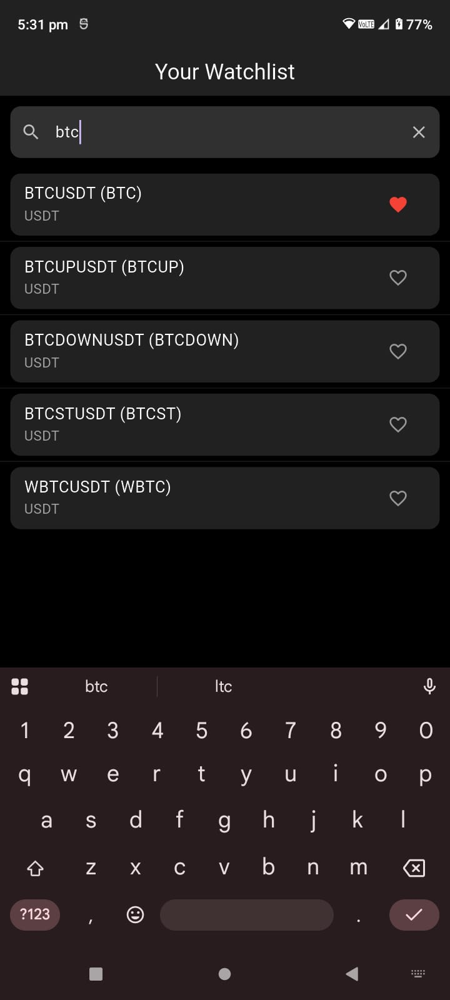
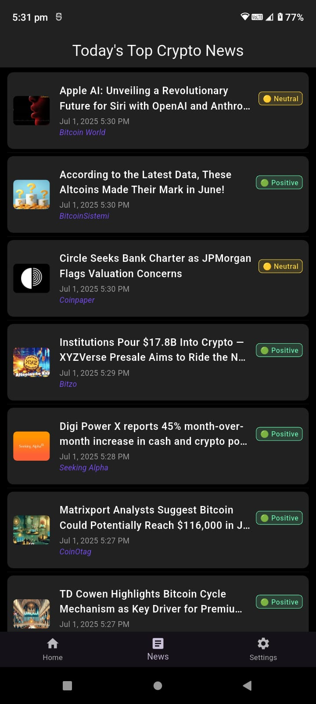
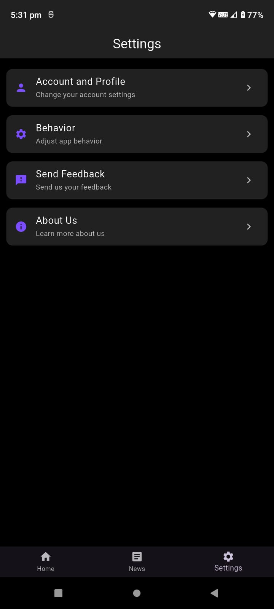
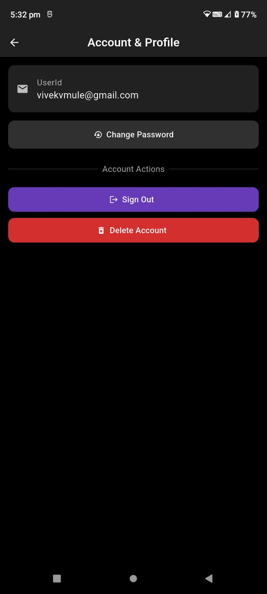
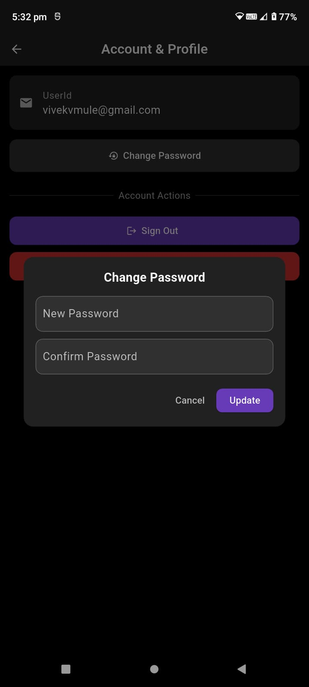
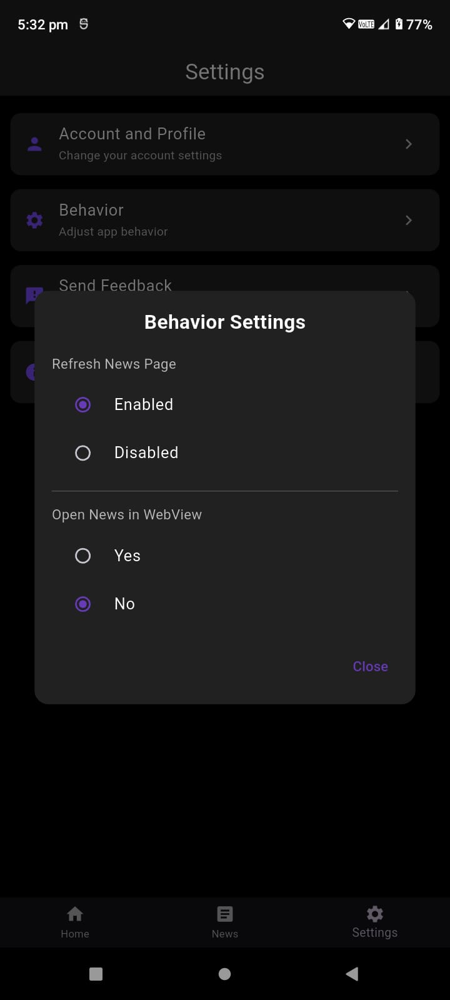
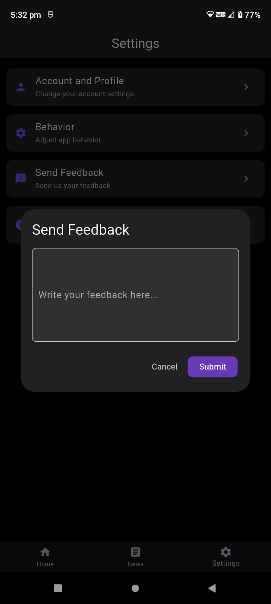

# 📊 Flutter Crypto App

A beautifully designed Flutter app to **track cryptocurrency prices**, view real-time charts, and stay updated with the latest crypto news. Seamlessly integrates Firebase and Binance WebSocket to deliver a modern crypto-tracking experience.

---

## 🚀 Features

- 🔐 Firebase Authentication (Login, Signup, Password Reset)
- ❤️ Watchlist: Add/remove favorite coins
- 📉 Real-time price tracking via Binance WebSocket
- 📈 Live TradingView charts for any coin
- 📰 Latest crypto news powered by CoinDesk
- 💬 In-app feedback system stored in Firestore

---

## 🛠️ Technologies Used

- **Flutter** (State management via Riverpod)
- **Firebase** (Auth + Firestore)
- **Binance WebSocket** for crypto data
- **TradingView Web Charts**
- **CoinDesk News API**

---

## 📸 Screenshots

 

 

 

 

---
